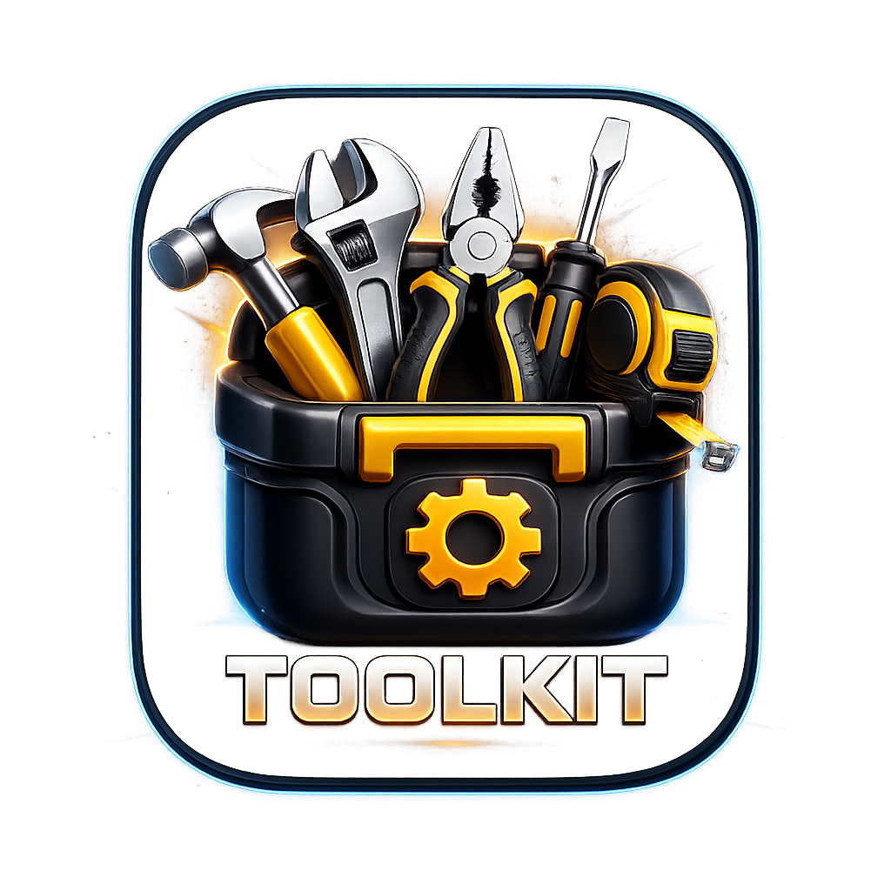

<div align="center">

  

  # ⚡ TOOLKIT AI — MULTI-TOOL UTILITY APPLICATION

  <p align="center">
    <b>An All-in-One Autonomous AI-Powered Utility Workspace & Multi-Tool Suite</b>
  </p>

  <p align="center">
    <a href="#-features--tool-suite"><strong>Explore Tools</strong></a> •
    <a href="#-quick-start"><strong>Quick Start</strong></a> •
    <a href="#-docker--containerization"><strong>Docker Setup</strong></a> •
    <a href="#-vercel-deployment"><strong>Vercel Deploy</strong></a> •
    <a href="#-screenshots--demo"><strong>Screenshots</strong></a>
  </p>

  <p align="center">
    
    
    
    
    
    
    
  </p>

</div>

---

## 🌟 Overview

**ToolKit AI** is a next-generation web application featuring **70+ built-in utility tools**, hardware integrations, 3D Canvas visualizers, and games. Powered by an intelligent **RAG Intent-Routing Engine**, ToolKit AI understands natural language prompts, auto-navigates to the exact tool required, pre-fills parameter fields, and supports side-by-side **Multi-Tool Workspace Split Views**.

---

## 📸 Screenshots & Demo

> [!TIP]
> Place your high-resolution application screenshots inside the [`screenshots/`](screenshots/) directory to showcase your live UI.

<div align="center">

| 🤖 AI SmartSearch & Routing | 🏙️ Split-Screen Multi-Tool Workspace |
| :---: | :---: |
|  |  |
| *Natural language tool intent routing* | *Side-by-side active tool execution* |

| 🌌 3D Holographic Analog Clock | 🎨 Particulate Canvas Color Picker |
| :---: | :---: |
|  |  |
| *Three.js WebGL particle morphing engine* | *Image shattering & particle color extractor* |

</div>

---

## 🔥 Key Highlights

- **🧠 Autonomous AI Intent Router**: Translates queries like *"Check London time and convert 100 USD to INR"* into instant navigation with pre-filled inputs.
- **⚡ Split-Screen Multi-Tool Workspace**: Run two interactive tools side-by-side simultaneously with synchronized layout controls.
- **🌌 3D WebGL Canvas Engine**: Custom particle shaders, bloom post-processing, shape morphing (Square / Hexagon / Circle), and hue transformations.
- **📱 Hardware & Device API Integrations**: Sensors (Accelerometer, Magnetometer, Ambient Light), Battery Manager, Web Audio API, and Flashlight.
- **🌙 Adaptive Theme Engine**: Dynamic Theme System with 5 curated palettes (`dark`, `light`, `neon-dark`, `plum-rose`, `olive-lime`).
- **🛡️ Secure Privacy & Terms Workflow**: Protected routes with mandatory Terms agreement and local device storage policies.

---

## 🛠️ Features & Tool Suite

ToolKit AI includes **70+ production tools** organized into 8 specialized categories:

<details open>
<summary><b>🧮 1. Calculative Tools (15 Tools)</b></summary>

| Tool | Description |
| :--- | :--- |
| **Age Calculator** | Precise chronological age calculator with day/hour breakdown |
| **BMI Calculator** | Body Mass Index calculator with health category spectrum |
| **Standard Calculator** | High-precision scientific arithmetic calculator |
| **Discount Calculator** | Markdown, savings, and final price calculator |
| **EMI Calculator** | Loan repayment, amortization schedule & monthly breakdown |
| **Electricity Calculator** | Appliance wattage, kWh usage & electricity bill estimator |
| **Fuel Calculator** | Trip fuel cost, distance, and mileage efficiency calculator |
| **Interest Calculator** | Simple & compound interest investment growth modeler |
| **Level Measure** | Real-time device orientation spirit level tool |
| **Line Chart** | Dynamic interactive data line chart renderer |
| **Mutual Fund Calculator** | SIP return estimator with wealth gain projections |
| **Pedometer** | Motion-sensor step counter & calorie estimator |
| **Percentage Calculator** | Ratio, percentage increase/decrease calculator |
| **Pie Chart** | Proportion visualizer & data pie chart generator |
| **Thermometer** | Temperature unit converter and ambient heat tracker |

</details>

<details open>
<summary><b>🛠️ 2. Utility & General Tools (15 Tools)</b></summary>

| Tool | Description |
| :--- | :--- |
| **Particulate Color Picker** | Shatters images into interactive WebGL particle palettes |
| **Audio Recorder** | Web Audio API mic recorder with waveform visualizer |
| **Cash Separator** | Currency denomination breakdown & bill counter |
| **Compass** | Device magnetometer digital heading compass |
| **Currency Converter** | Real-time global foreign exchange rate converter |
| **Flashlight** | Device camera LED torch controller |
| **Metal Detector** | Magnetic field strength anomaly meter |
| **Noise Detector** | Decibel (dB) sound level meter with audio analyzer |
| **QR Code Generator** | Custom SVG/PNG QR code creator with styling |
| **QR Scanner** | High-speed camera barcode and QR code reader |
| **Todo List** | Task manager with persistence and priorities |
| **Translator** | Multi-language text translation tool |
| **Unit Converter** | Length, mass, area, volume, and pressure converter |
| **Weather Forecast** | Real-time weather search with forecasts and metrics |
| **WhatsApp Direct** | Direct message link creator without saving contacts |

</details>

<details>
<summary><b>🎮 3. Interactive Games (5 Games)</b></summary>

| Game | Description |
| :--- | :--- |
| **Chess** | Interactive chess game board with move engine |
| **2048** | Touch-swipe & keyboard 2048 tile sliding game |
| **Snake Game** | Classic grid snake game with responsive touch/D-pad controls |
| **Tic Tac Toe** | 2-player & AI Tic Tac Toe with dynamic score tracking |
| **Memory Card Game** | Flip-to-match memory concentration game |

</details>

<details>
<summary><b>🩺 4. Health & Wellness (7 Tools)</b></summary>

| Tool | Description |
| :--- | :--- |
| **Brain Reaction** | Reaction speed timer & cognitive prompt testing |
| **Breath Control** | Guided rhythmic breathing assistant for relaxation |
| **Nutrition Expert** | Caloric intake & macro-nutrient balance advisor |
| **Periods Tracker** | Menstrual cycle log & fertility window predictor |
| **Sleep Assistant** | Bedtime calculator & ambient sleep sound generator |
| **Vision Studio** | Ishihara color-blindness test & visual acuity charts |
| **Water Tracker** | Daily hydration goal tracker & reminder logger |

</details>

<details>
<summary><b>📄 5. Text & Document Tools (9 Tools)</b></summary>

| Tool | Description |
| :--- | :--- |
| **Text Scanner (OCR)** | Tesseract.js image-to-text extraction |
| **Doc/Word Converter** | Document formatting & file layout converter |
| **Password Generator** | Cryptographically secure random password creator |
| **Random Password & Dice** | Polyhedral dice simulator and key builder |
| **Text Encryptor** | AES cipher encryption and decryption utility |
| **Text Repeater** | Bulk string repetition & formatting utility |
| **Text to Binary** | ASCII string to binary/hex/octal encoder |
| **Type Tester** | Words-per-minute (WPM) typing speed tester |

</details>

<details>
<summary><b>⏰ 6. Time & Date (6 Tools)</b></summary>

| Tool | Description |
| :--- | :--- |
| **Analog Clock** | 3D Holographic particle clock with UnrealBloomPass glow |
| **Digital Clock** | Minimalist digital clock with seconds & date display |
| **Leap Year Checker** | Year divisibility & calendar leap year verifier |
| **Stopwatch** | Precision lap timer with split records |
| **Time Zone** | World clock comparison & time offset converter |
| **Timer** | Count-down timer with audio alerts |

</details>

<details>
<summary><b>🎥 7. Media Tools (4 Tools)</b></summary>

| Tool | Description |
| :--- | :--- |
| **Image Compressor** | Client-side Canvas image size optimization |
| **PDF Creator** | Custom PDF document builder & exporter |
| **Video to Audio** | FFmpeg WebAssembly video audio track extractor |
| **Counter** | Multi-tally click counter with history |

</details>

<details>
<summary><b>📱 8. Device Diagnostics (9 Tools)</b></summary>

| Tool | Description |
| :--- | :--- |
| **Battery Status** | Real-time battery level, charging state, & time remaining |
| **Battery Test** | Hardware discharge rate diagnostics |
| **CPU Info** | Logical processor core count & architecture info |
| **Device Info** | User-agent, screen resolution, and platform detector |
| **Network Speed** | Ping, download latency, and connection state monitor |
| **RAM Info** | Memory allocation & JS heap footprint meter |
| **Sensor Info** | Real-time motion, orientation, & light sensor stream |
| **Speaker Cleaner** | Frequency sound wave audio speaker dust/water ejector |
| **Storage Info** | IndexedDB & LocalStorage quota usage tracker |

</details>

---

## 🏗️ Architecture & Technology Stack

```
toolkit/
├── src/
│   ├── components/      # Reusable UI components & Layout wrappers
│   ├── context/         # Auth & Theme State Providers
│   ├── lib/             # RAG Engine, Intent Matcher, Feedback Engine
│   ├── pages/           # Primary views (Home, Login, MultiToolView, Insights)
│   ├── services/        # Gemini AI & OTP Services
│   └── tools/           # 70+ Tool Components categorized by domain
├── public/              # Static assets, media & icons
├── Dockerfile           # Multi-stage production container definition
├── docker-compose.yml   # Local Docker Desktop orchestration
├── nginx.conf           # Production Nginx server routing & caching
└── vite.config.ts       # Vite bundler & PWA configuration
```

---

## 🚀 Quick Start

### 1. Prerequisites
- Node.js `v18.0` or higher
- `npm` or `yarn`

### 2. Installation
```bash
# Clone repository
git clone https://github.com/Madankk/TOOLKIT-MULTI-TOOL-APPLICATION.git
cd toolkit

# Install dependencies
npm install
```

### 3. Environment Variables Setup
Copy `.env.example` to `.env.local` and add your Firebase & AI keys:
```bash
cp .env.example .env.local
```

### 4. Development Server
```bash
npm run dev
```
Open **`http://localhost:5173`** in your browser.

---

## 🐳 Docker & Containerization

Test the exact production Nginx container locally on **Docker Desktop (Mac/Linux/Windows)**:

```bash
# 1-Command Startup with Docker Compose
docker compose up --build -d
```

Access local Docker environment at: **`http://localhost:8080`**

To stop the container:
```bash
docker compose down
```

---

## 🌐 Vercel Deployment

This project is optimized for 1-click deployment on **Vercel**:

1. Import your GitHub repository into [Vercel](https://vercel.com/new).
2. Set Build Settings:
   - **Framework**: Vite
   - **Build Command**: `npm run build`
   - **Output Directory**: `dist`
3. Add Environment Variables from `.env`.
4. Click **Deploy**.

---

## 📁 Adding Screenshots

To add your own screenshots to the README:
1. Capture screenshots of your running app.
2. Save them into the [`screenshots/`](screenshots/) directory using these filenames:
   - `smartsearch.png`
   - `multitool.png`
   - `analog_clock.png`
   - `color_picker.png`
3. Commit and push to GitHub — your README will automatically display your live screenshots!

---

## 📜 License

Distributed under the MIT License. See `LICENSE` for more information.

---

<div align="center">
  <sub>Built with ❤️ by Madan KK using React, TypeScript & Three.js</sub>
</div>
